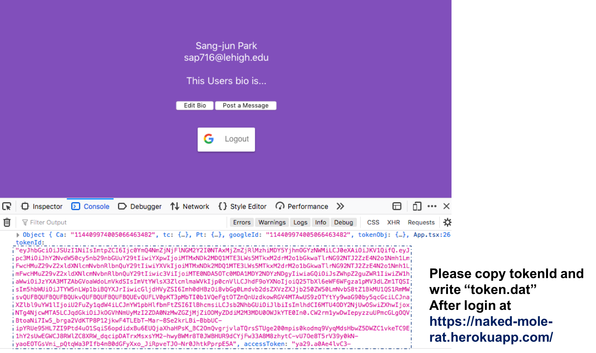

## Backend Server
https://limitless-ocean-62391.herokuapp.com/

## Refactoring of technical debt
- Google ID Token Verifier
Need a token to write a message, and Like vote
author only can edit and delete their message
- Update Like vote 
user can do Like vote one time for each message (can't increase it cumulatively).
- File upload
Now, file information could be inserted into DB.
- Convinient option for web and Android
Can attach file and hyperlink into correspond message (combined into last POST message, URL: [GET]/join) 
Possible to see all messages by certain user (URL: [GET]/history)
- Bad word filtering
hide the message with asterisk, and raise the flag (see by URL:[GET]/join)

## URL
- login by google         [POST]api/users/login
- write a message         [POST]api/messages
- upload a file           [POST]api/upload

- see all messages        [GET]api/messages
- see one message         [GET]api/message/[messageId]
- see user's all messages [GET]api/history/[userId]
- see user's profile      [GET]api/profile/[userId]
- see all files           [GET]api/files
- download a file         [GET]api/download
- list all table info     [GET]api/join

- edit a message          [PUT]api/messages/[messageId]
- update Like vote        [PUT]api/likes/[messageId]

- delete a message        [DELETE]api/messages[messageId]
- delete Like vote        [DELETE]api/likes/[messageId]

- service
: block slangs and raise a flag (fuck/shit/bitch/asshole/damn)

## Unit Testing
- Run
cd test
python unitTesting.py
I checked that python test script is running without errors. If it is not working then, please contact to Sang-Jun Park (sap716@lehigh.edu).

- Requirement for testing: 
it needs Google ID Token to test above routes.
To get Token, please visit [front-end Heroku server](https://naked-mole-rat.herokuapp.com/), and get the Google ID Token as shown image below.
Please write ID Token into "token.dat" file in test folder.

